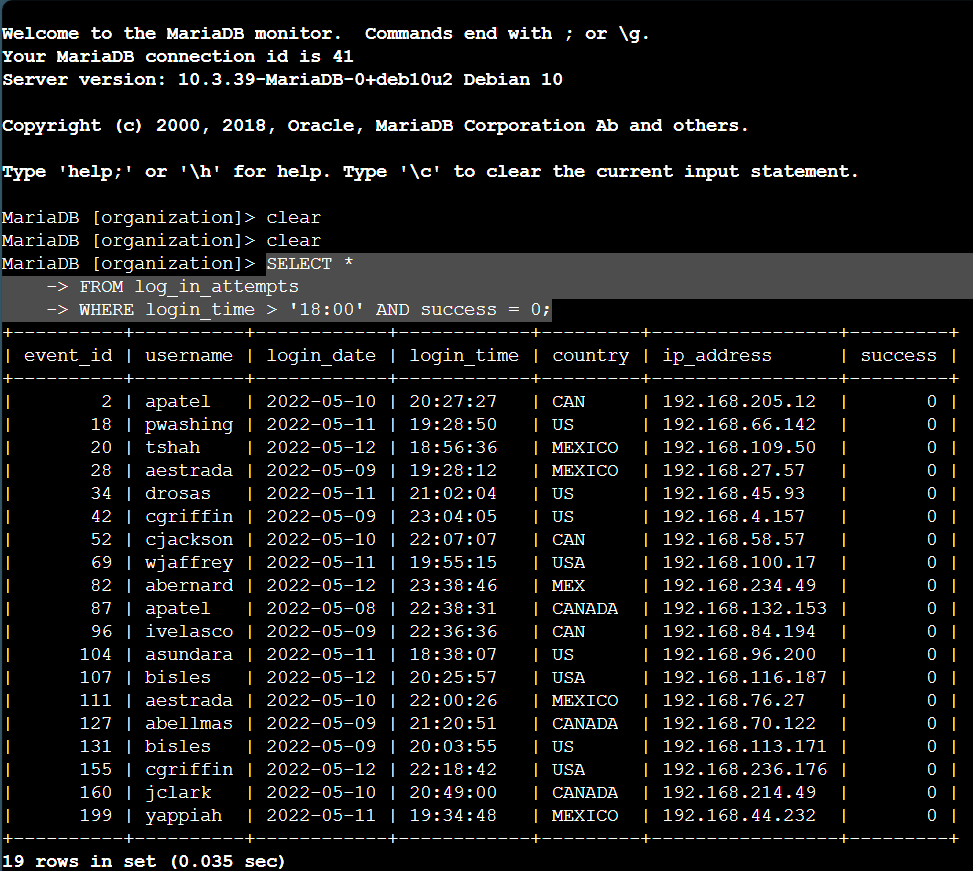
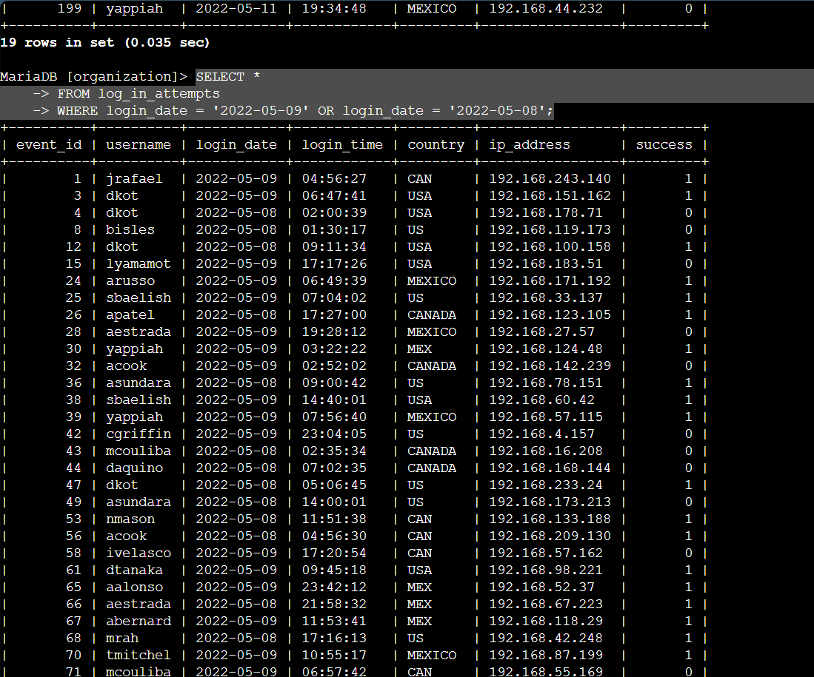
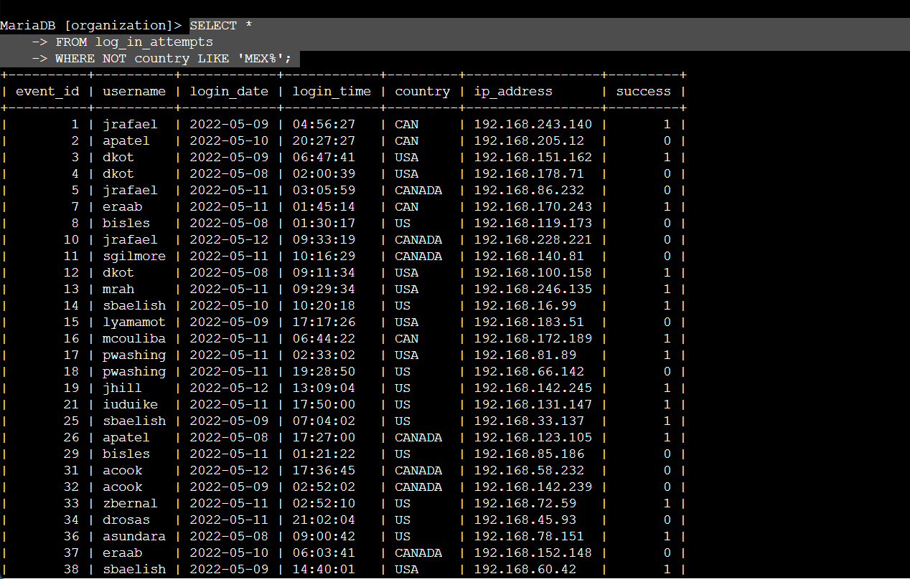
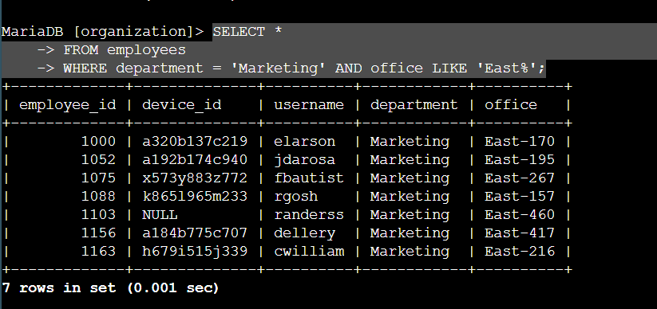
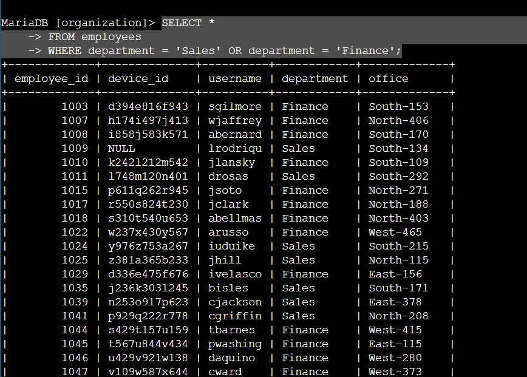
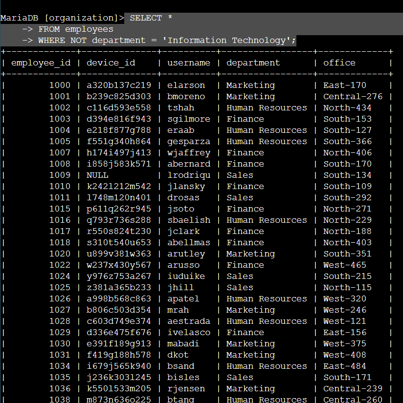

#  SQL Query Filters

##  Overview

As a security professional, I used SQL filters to identify and investigate security issues related to login activity and department-based machine updates in a large organization.

Apply filters to SQL queries

## Project description

As a security professional at a large organization, part of my job is to investigate security issues to help keep the system secure. Recently I've discovered potential security issues pertaining to employee login attempts and machines. I will investigate these potential security issues by retrieving the organization's data from different data sets using SQL filters.

## Retrieve after hours failed login attempts

I’ve recently discovered a potential security incident that has occured after business hours of 18:00. To investigate this it will query data from the log_in_attempts table of the organization's data and review after hours log in activity. Specifically reviewing failed login attempts after 18:00. The time of the log in will be located in the ‘login-time’ column and the success of the login attempt will be in the ‘success’ column of the log_in_attempts table. Using filters in SQL the correct query is as follows SELECT * FROM log_in_attempts WHERE login_time > 18:00 AND success = 0;  We are SELECTING all data(*) FROM the log_in_attempts table WHERE (indicating the filtration based on columns in the table) the login_time is greater than (>)  18:00, AND ( meaning both conditions must be met), the success of the login attempt has failed (represented as a 0 or FALSE, a successful login is represented by a 1 or TRUE). The output shows all data in the log_in_attempts table that have failed after 18:00.

  
Retrieve after hours login

  

## Retrieve login attempts on specific dates

A security event occurred on May 5th, 2022. To investigate the event I need to review login activity on this day and the day before (May 8th, 2022). I’ll need to review all login attempt data on these two days only, this data is located in the ‘login_date’ column of the log_in_attempts table. My query will be SELECT * FROM log_in_attempts WHERE login_date = ‘2022-05-09’ OR login_date = ‘2022-05-08”; In this query we use the OR operator to filter all the data in the log_in_attempts table to show all data on the day of the security incident and the day before. The OR operator is used to specify that either condition in an argument can be met.The format used for dates in SQL is YYYY/MM/DD.

  
Retrieve login attempts on specific dates

## Retrieve login attempts outside of Mexico

There has been recent suspicious login activity, however our team has discovered that it is happening outside of Mexico. To investigate this I'll need to review the data in the log_in_attmepts table. Specifically, I'll need to review data for everywhere but Mexico. I’ll filter this data by using the country column of the log_in_attempts table to ensure the country of Mexico is excluded. My query will be SELECT * FROM log_in_attempts WHERE NOT country LIKE ‘MEX%’;  The output will show data for all countries that are not Mexico because of the NOT operator after the WHERE clause. The NOT operator indicates that the following condition should not be included in a data set. I’ve noticed that in the country column Mexico also appears as MEX. So to ensure I have excluded all data including the country of Mexico, I used the LIKE operator. This operator allows me to filter based on patterns, combined with the % wildcard this allows me to filter out all countries starting with MEX. The % wildcard after the MEX means that data with any amount of values after MEX will be excluded.

  
Retrieve login attempts outside of mexico

## Retrieve employees in Marketing

Our team must perform a security update on employee machines of the Marketing department in the East building. I have been tasked with getting information on these employee machines, I’ll do this by querying the employees table. The information I need can be filtered by using the department column and the office column of the employees table. My query will be SELECT * FROM employees WHERE department = ‘Marketing’ AND office LIKE ‘East%’; This will display information for all employees in the East building that are in the Marketing department. Using the AND operator means both conditions must be met. The data must show employees in the Marketing department represented by = ‘Marketing’ after the WHERE clause and they must be in the East building. Because buildings are represented with a hyphen and different values after the word East we use the LIKE operator and a wildcard (%) to represent all data in the office column that start with East and have any amount of values after it.

  
Retrieve employees in Marketing

## Retrieve employees in Finance or Sales

Now we must perform a different security update for employees in the Sales and Finance departments. I will be filtering the data using only the department column to ensure the only information returned is for employees from the Sales or Finance department. My query will be SELECT * FROM employees WHERE department = ‘Sales’ OR department = ‘Finance’; I used the OR operator to ensure either of my arguments information is returned. Even though I am filtering the data using the same column it is important to have a complete argument by entering the department after the WHERE clause and the OR operator. The result is data on employees in Sales and Finance departments

  
Retrieve employees in Finance or Sales

## Retrieve all employees not in IT

Our last update will be for machines for employees that are not in the Information Technology department, as they’ve already received the update.  I will filter this data using the department column of the employee table, to ensure I am excluding employees in the Information Technology department. My query will be SELECT * FROM employees WHERE NOT department = ‘Information Technology’;  The NOT operator after the WHERE clause ensures that the argument will not be included in the data set. The’ =’ operator indicates that the department to be excluded is Information Technology. The result is information on all employees not in the Information Technology department.

  
Retrieve all employees not in IT

## Summary

This project demonstrates my ability to apply SQL filtering techniques to analyze organizational login and employee data. I used real-world logic to investigate security concerns—such as failed logins after hours, activity outside of designated regions, and department-specific machine updates.
Through practical SQL queries using WHERE, AND, OR, LIKE, and NOT, I filtered large datasets efficiently to support incident response and secure infrastructure operations.
